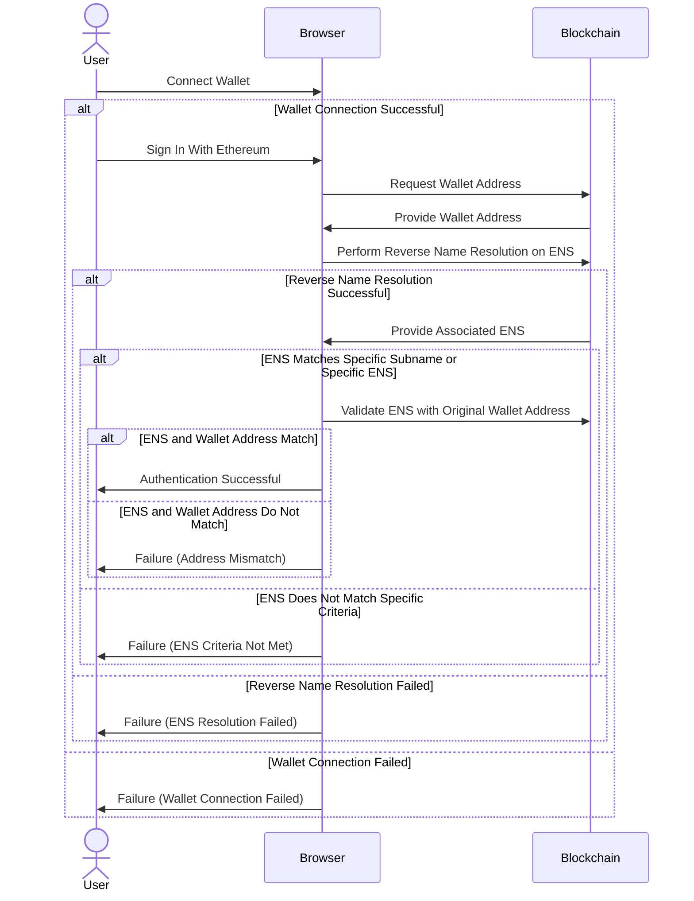

# ETH-Drive

## ENS Authentication

```mermaid
sequenceDiagram
  actor User as User
  participant Browser as Browser
  participant Blockchain as Blockchain

  User->>Browser: Connect Wallet
  alt Wallet Connection Successful
    User->>Browser: Sign In With Ethereum
    Browser->>Blockchain: Request Wallet Address
    Blockchain->>Browser: Provide Wallet Address
    Browser->>Blockchain: Perform Reverse Name Resolution on ENS
    alt Reverse Name Resolution Successful
        Blockchain->>Browser: Provide Associated ENS
        alt ENS Matches Specific Subname or Specific ENS
            Browser->>Blockchain: Validate ENS with Original Wallet Address
            alt ENS and Wallet Address Match
                Browser->>User: Authentication Successful
            else ENS and Wallet Address Do Not Match
                Browser->>User: Failure (Address Mismatch)
            end
        else ENS Does Not Match Specific Criteria
            Browser->>User: Failure (ENS Criteria Not Met)
        end
    else Reverse Name Resolution Failed
        Browser->>User: Failure (ENS Resolution Failed)
    end
  else Wallet Connection Failed
    Browser->>User: Failure (Wallet Connection Failed)
  end

```
