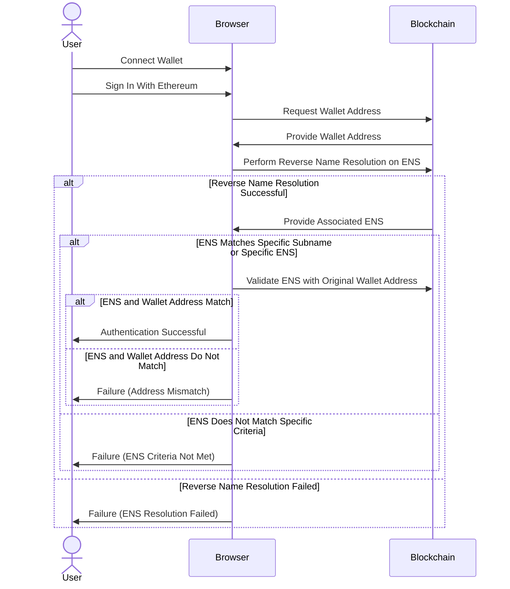

# ETH Drive

## Project Introduction

[presentation](https://docs.google.com/presentation/d/1sG3eO6FlGcO1wqeUr6yUVyhTrKzwDPA8qJbDeXs8W2Q/edit?usp=sharing)

## Project Description

ETH Drive is a Web3 cloud storage system for sharing content securely and easily, similar to Google Drive.

Now, there are some web3 cloud storage systems that use IPFS to distribute and store contents. But, in IPFS, anyone can access contents if they know their cid and contents name. So, IPFS is not very good at storing contents securely and restricting access.

ETH Drive solves those issues by using ENS, Filecoin(Web3.storage), PGP(Pretty Good Privacy). Contents are encrypted with PGP and then uploaded to Filecoin. Therefore, even if the cid and contents name is leaked, other people will not be able to read.

Additionally, encrypted contents can only be decrypted by authorized users. We use the ENS domain mechanism to determine whether the user is authorized. If the ENS parent domain is the same, users can belong to the same group even if the subdomains are different. Then, only users belonging to the same group can access the contents.

## How it's Made

### Verify whether a user is authenticated by using ENS

1. User Login with Ethereum Wallet: When users log in to ETH Drive, they provide their Ethereum wallet address.
2. ENS Domain Retrieval via Ethers.js: Utilize Ethers.js to retrieve the ENS domain name linked to the provided wallet address. This process involves mapping the Ethereum address to its corresponding ENS domain.
3. Group Authentication via Common Parent Domain: Check if the user's ENS domain is a subdomain of a predetermined parent domain. This step is crucial for group authentication, as it ensures that the user belongs to a specific group or organization identified by the common parent ENS domain. Users with subdomains under this parent domain are authenticated as part of the group, enabling streamlined access and verification within the ETH Drive system.

### Upload encrypted content to Filecoin and allow only authorized users to decrypt it

1. Create a public key and private key for each user.
2. Register the public key in the user's ENS text record. The private key should be managed on the user's local PC and not leaked outside.
3. Encrypt contents using a common key before users upload it to Filecoin.
4. Encrypt the common key with the public key for each user.
5. After a user downloads encrypted contents, they can decrypt the common key with their own private key and use it to decrypt the contents.
   background image

## ENS Authentication

